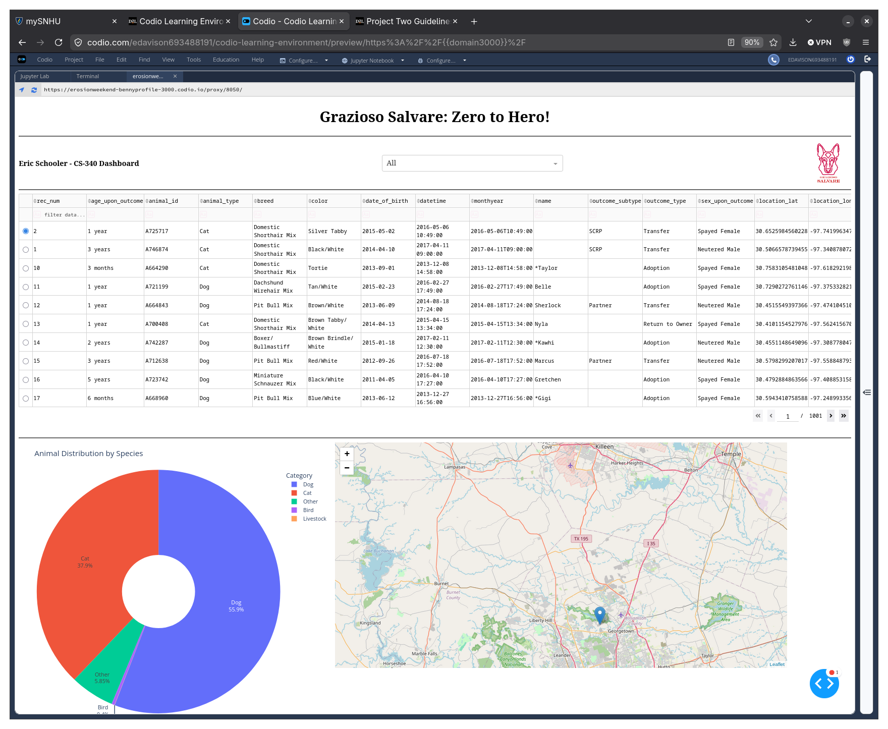
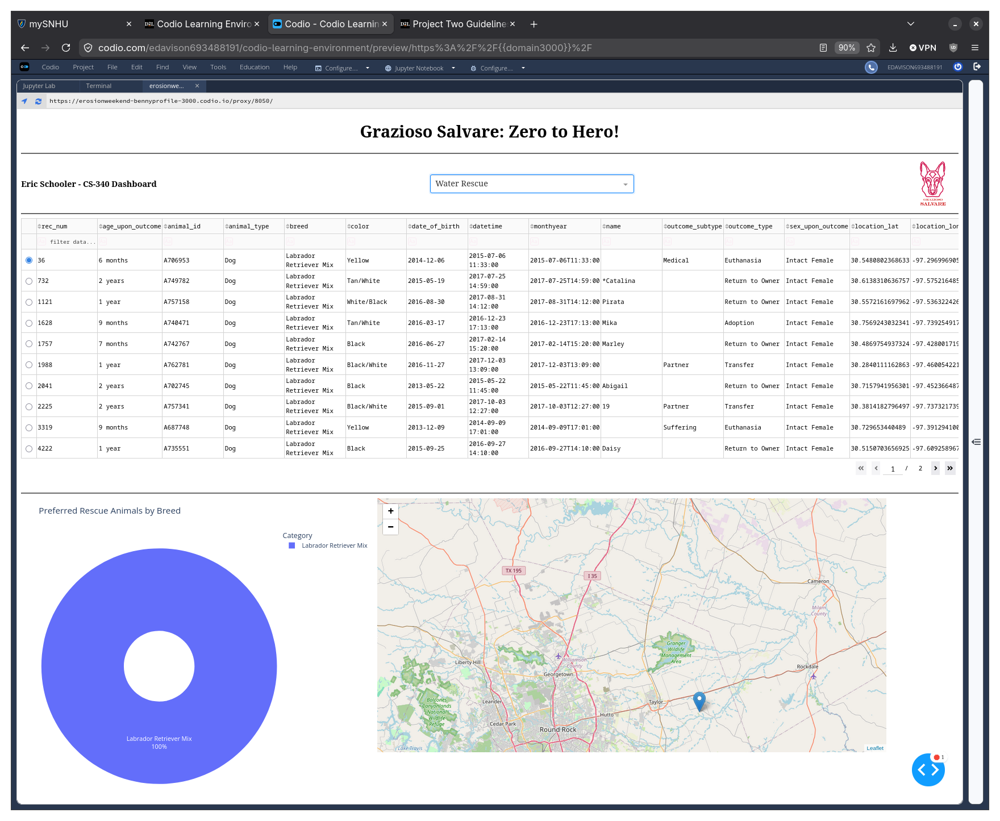
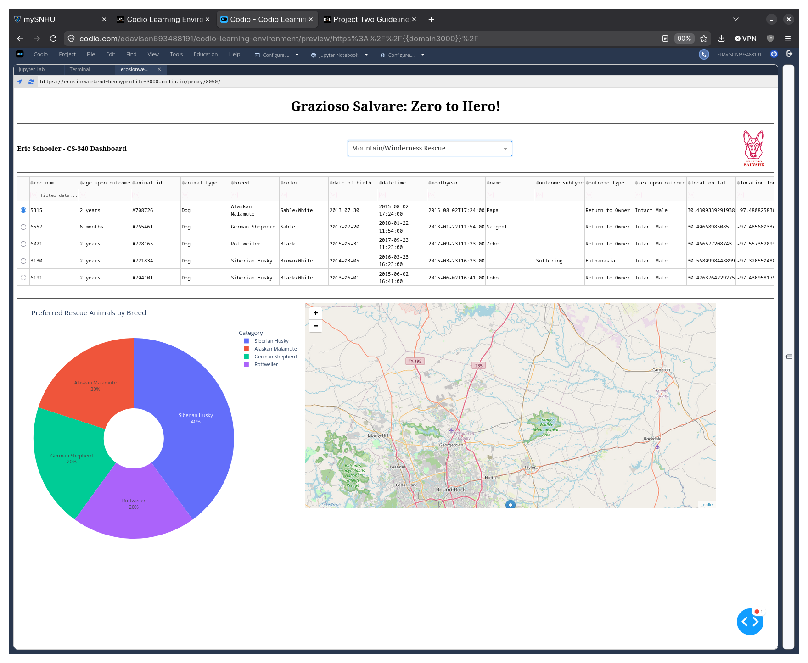
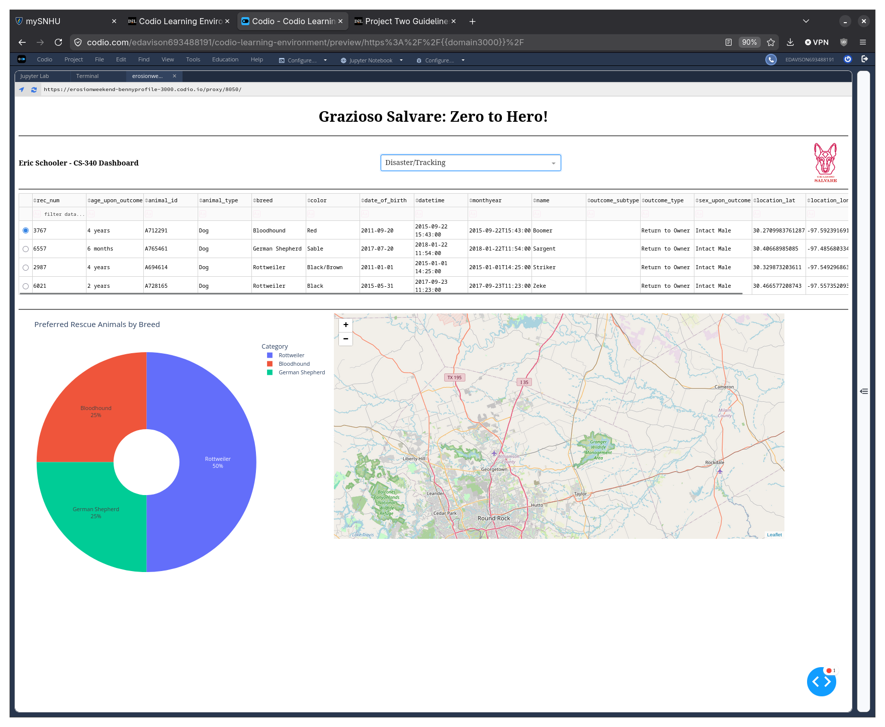

CS-340
## Functionality
Below you can see 4 screenshots showing execution of the application with all 3 filters and without any filters.

Note that for the first figure all data is sorted by animal type instead of breed, otherwise a pi chart malfunctions due to the sheer volume of data.  Incidentally, notice that bat is in the top 5, kinda odd.

This chart is of water rescue eligible breeds.  I did double check with the CSV and for this entry Labrador Retriever Mix is the only valid option.

Here is mountain or wilderness rescues, pretty good spread of data.  Here I also want to mention that the layout is not preferred, but in order to fit all data in I had to zoom out more then I liked.

Last but not least the trackers.  Honestly, considering the kind of data I was surprised at the limited results.  However, many of the entries in the database are ‘mix’ breeds but the design doc was very specific so I did not change it to include mixes.

## Rationale
In this project we used MongoDB for its powerful search and data functions.  While considering the CSV used to import the data, an SQL database would perhaps have suited this database better.  Generally MongoDB is best utilized in a MEAN full stack, in this instance the JSON data storage helped us to find many results while limiting the number of queries.  It is also worth noting that while MongoDB is not traditionally used in scenarios benefiting a table, both SQL and no-SQL databases are comparable in speed and resources so at this point I find its more about the data type you would prefer to work with.

In my opinion, a relational SQL database may have been a better fit for this type of dashboard because the animal shelter data is highly structured and uses consistent fields. These fields are frequently filtered, sorted, and grouped, which are common strengths of SQL databases. MongoDB still works for this project because it stores animal records as flexible documents and integrates well with Python through PyMongo, but the use case does not strongly require MongoDB’s schema flexibility.

One bonus of Python use is its strong capabilities for creation of the dashboard we used.  One of the primary use cases of python is data analysis which fit perfect for our case.  Dash was used to create the web dashboard that we used.  It provided both the view and controller structure of the application, making the full stack easier to program, requiring significantly less code for a functional application.

Pandas was used to organize the queries into a chart (SQL?).  This functioned as a frontend filter and display.  Plotty Express was used to display our pi chart and Dash Leaflet was used as a means to mark the animals location on the map.

Resources used:
- Python: https://docs.python.org/3/
- MongoDB: https://www.mongodb.com/docs/
- PyMongo: https://pymongo.readthedocs.io/
- Dash/Plotty: https://dash.plotty.com/
- Dash Leaflet: https://dash-leaflet.com/ 

## Steps
First step was to create a custom CRUD Python module for creating, reading, updating, and deleting data establishing the same principles as HTTP protocols GET, POST, PUT, PATCH, or DELETE.  Here we apply them to Python to complete basic database maintenance instead of mongoose (hence PyMongo).

Next I loaded the CSV data into the MongoDB allowing me to run it through the built in function Pandas.  After the data had been loaded I created a dashboard layout using Plottys Dash.  This gave me a dropdown menu which users could use to filter the animals listed to the clients specific instructions.

Last I added a chart callback that updates based on the data filter.  Whenever the data changes the pi chart updates.  For all data in the DB I had to get creative with the resting state of the pi chart.  After some consideration I decided a pi chart was best to represent the data when filtered but had to find a good solution for when it was not.  In the end the best solution I found was to separate data by animal type (there is a lot less of those).  You have to remember that space is limited and eventually the data representation with too much data has diminishing returns.

## Challenges
The first challenge I faced was the drop down menu which would not update with the filters correctly.  At first whenever the filter was changed nothing was returned.  This caused the table and graph to never update.  I fixed this by resolving a typo in the target database.

Another was the graph which I have discussed before, but the over-saturation of data actually caused the pi chart to ‘bleed’ and become distorted as the system attempted to fit a seemingly infinite data set into a finite space.

Overall, the project was completed by using MongoDB as the data store, Dash as an interface, and Python as a means to manipulate the data.  For a smaller size project this turned into an effective way to easily represent the data into one place.
